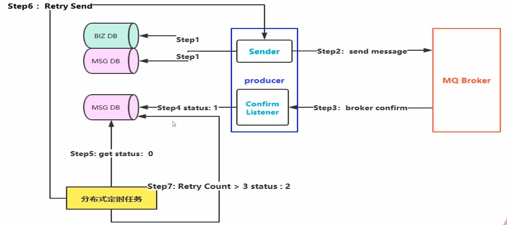
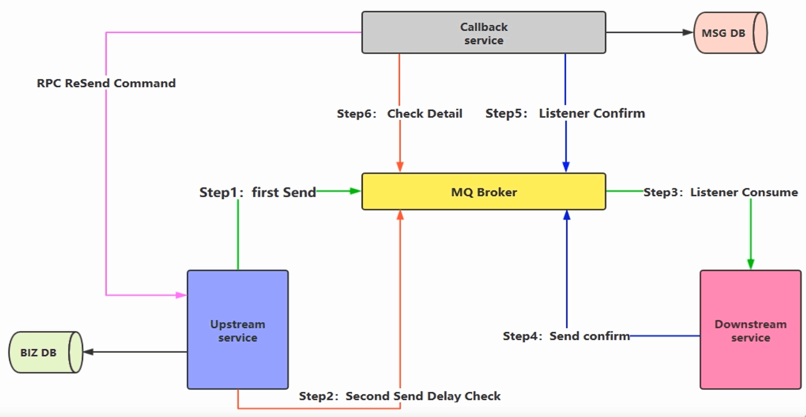
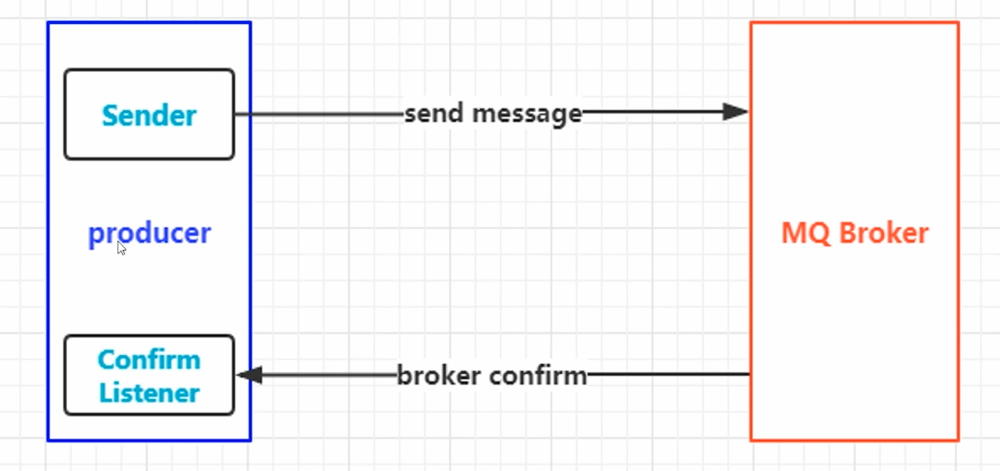

# RabbitMQ高级篇


# 1、 RabbitMQ如何保障100%的投递成功

	1、什么是生产端的可靠性投递？

* 保障消息的成功发出
* 保障MQ节点的成功接收
* 发送端收到MQ节点（Broker）的确认应答
* 完善的消息进行补偿机制

## 1.1 生产段-可靠性投递（一）

	大厂的解决方案：

* **消息落库，对消息状态进行达标**（因为设计到数据库高并发场景下这种情况不合适）



第一步：发送消息前先把业务落库，消息也落库（status为0）。（缺点是写入了两次数据库）

第二步：发消息到Broker，消费端消费消息

第三步：Broker确认，生产端应答消息

第四步：更新MSG库中的status为1

第五步：假设在高并发情况下，网路闪断，导致第三步失败。那么listener永远也收不到确认了。这时候就会有问题。使用分布式定时任务，可以每过5分钟获取MSG库中的status为0的消息，则走 第六步：重新投递一次。这里有个隐藏问题，当定时任务开始时刚好有消息刚发送，本来能成功，但是定时任务又重新发了一条消息出来了。这时候可以在MSG库中增加字段，比如create_time和update_time，找这两个时间间隔大于5分钟之类的。。

第六步：分布式定时任务5分钟检测到MSG库中status为0的消息，重新投递消息。

第七步：如果重新投递次数过多的话，就每必要重试了，可以将MSG库中的status改为2。


* **消息的延迟投递，做二次确认，回调检查**（大厂的主流解决方案）



第一步：先将业务消息落库，然后发消息给Broker。

第二步：再发送一条延迟消息投递检查，根据业务来决定第二次发送消息的时间。（这里假设5分钟）

第三步：消费端监听指定的队列，收到消息进行处理。

第四步：发送确认消息给Broker。（这里有CallbackService服务区）

第五步：CallBackService服务监听Broker的下游服务，如果收到确认消息，则对该消息进行落库MSG。否则进行第六步

第六步：CallBackService服务也监听演示发送的消息，他会先从MSG库中查对应的数据，如果没有的话，则会主动发起一个RPC通信，让生产端再重新发送一次消息。


# 2、幂等性

## 2.1、幂等性概念

借鉴数据库乐观锁机制：比如我们执行一条更新库存的SQL语句：

```sql
UPDATE T_REPS SET count = count - 1 , varsion = version + 1 WHERE version = #{version}
```

**在海量订单产生的业务高峰期，如何避免消费的重复消费问题？**

**消费端--保障幂等性**

* 消费端实现幂等性，就意味着，我们的消息永远不会消费多次，即使我们收到了多条一样的消息，但也只会消费一次。

业界主流的幂等性操作：

* 唯一ID + 指纹码机制

  * 唯一ID + 指纹码机制，利用数据库主键去重

  * SELECT COUNT(1) FROM T_ORDER WHERE ID = 唯一ID + 指纹码

  * 好处：实现简单

  * 坏处：高并发下有数据库写入的性能瓶颈

  * 解决方案：跟进ID进行分库分表进行算法路由将ID进行路由

    

* 利用Redis的原子性去实现
  * 使用Redis进行幂等，需要考虑的问题：
    * 第一：我们是否要进行数据落库，如果落库的话，关键解决的问题是数据库和缓存如何做到原子性？
    * 第二：如果不进行落库，那么都存储到缓存中，如何设置定时同步的策略？


# 3、Confirm确认消息

## 3.1、理解Confirm消息确认机制

消息的确认，是指生产者投递消息后，如果Broker收到消息，则会给生产者一个应答。生产者进行接收应答，用来确定这条消息是否正常的发送到Broker，这种方式也是消息的可靠性投递的核心保障！




## 3.2、如何实现Confirm确认消息？

* 第一步：在channel上开启确认模式：channel.confirmSelect()
* 第二步：在channel上添加监听：addConfirmListener，监听成功和失败的返回结果，根据具体的结果对消息进行重新发送、或记录日志等后续处理。


# 4、 Return消息机制

Return Listener用于处理一些不可路由的消息

消息生产者通过指定一个Exchange和RoutingKey，把消息送达到某一个队列中去，然后消费者监听队列，进行消费处理操作

但是在某些情况下，如果我们在发送消息时，当前的Exchange不存在后者指定的RoutingKey路由不到，这个时候如果我们需要监听这种不可达的消息，就要使用Return Listener。

基础API中有一个关键的配置项：

* Mandatory：如果为true，则监听器会接收到路由不可达的消息，然后进行后续处理；如果为false，那么Broker端自动删除该消息


# 5、消费端限流

## 5.1、什么是消费端限流？

假设一个场景，首先，RabbitMQ服务器有上万条数据未处理的消息，随便打开一个消费者客户端，会出现下面情况：

* 巨量的消息瞬间全部推送过来，但是我们单个客户端无法同时处理这么多数据！

解决办法：RabbitMQ提供了一种qos（服务质量保证）功能，即在非自动确认消息的前提下，如果一定数据的消息（通过基于consume或者channel设置Qos的值）未被确认前，不进行消费新的消息。

``` java
/**
* 该方法是在消费端使用
* 参数说明：uint prefetchSize, ushort prefetchCount, bool global
* prefetchSize：消息的限制大小，一般这个参数设置为0
* prefetchCount：会告诉RabbitMQ不要同时给一个消费者推送多余N个消息，即一旦有N个消息还没有ack，则该consumer将block掉，直到有消息ack
* global：true/false 是否将上面设置应用于channel，即上面限制时channel级别的还是consumer级别
*/
void BasicQos(uint prefetchSize, ushort prefetchCount, bool global);
//prefetchSize和global，RabbitMQ没有实现
//prefetch_count在no_ack = falsed 情况下生效，即在自动应答的情况下，这两个值是不生效的。
```

