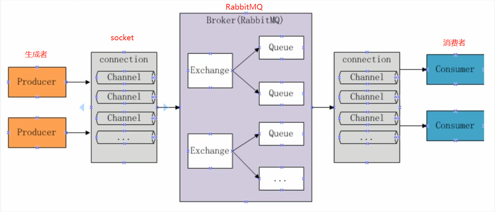
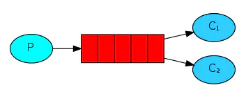
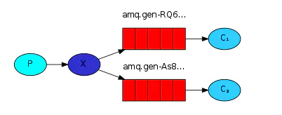
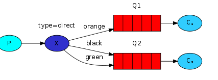
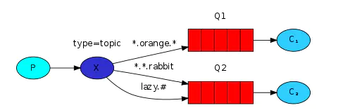
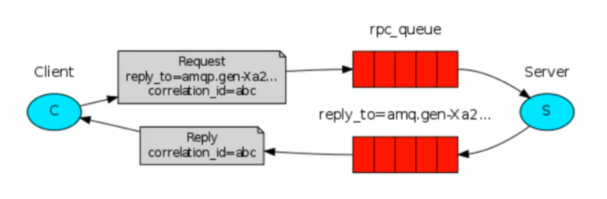

# RabbitMQ

# 1、介绍

## 1.1 RabbitMQ

​		MQ 全程为Message Queue，即消息队列，RabbitMQ是由Erlang语言开发，基于AMQP（Advanced Message Queue高级消息队列协议）协议实现的消息队列，他是一种应用程序之间的通信方法，消息队列在分布式系统开发中应用非常广泛。[RabbitMQ官方地址](http://www.rabbitmq.com/)

​	开发中消息队列通常有如下应用场景：	

​		1、任务异步处理

​			将不需要同步处理的并且耗时长的操作由消息队列通知消息接收方进行异步处理。提高了应用程序的相应时间。

​		2、应用程序解耦

​			MQ相当于一个中介，生产方通过MQ与消费方交互，它将应用程序进行解耦。

​	

​	市场上还有哪些消息队列？

​		ActiveMQ、RabbitMQ、ZeroMQ、Kafka，MetaMQ、RocketMQ、Redis。

 

## 1.2 其他相关知识

## 	AMQP

​		AMQP，即Advanced Message Queuing Protocoi，一个提供统一消息服务的应用层标准高级消息队列协议，是应用层协议的一个开放标准，为面向消息的中间件设计。基于此协议的客户端与消息中间件可传递消息，并不受客户端/中间件不同产品，不同的开发语言等条件限制。Erlabg中的实现有RabbitMQ等。

​	总结：AMQP是一套公开的消息队列协议，最早在2003年被提出，它旨在从协议层定义消息通信数据的标准格式，为的就是解决MQ市场上协议不同意的问题。RabbitMQ就是遵循AMQP标准协议开发的MQ服务。

[AMQP官网](http://www.amqp.org)


### 	JMS是什么？

# 	Java消息服务

​			Java消息服务（Java Message Service，JMS）应用程序接口是一个Java平台中关于面向消息中间件（MOM）的API，用于在两个应用程序之间，或分布式系统中发送消息，进行一部通信。Java消息服务是一个于具体平台无关的API，绝大多数MOM提供商都对JMS提供支持。

​		总结：JMS是Java提供的一套消息服务API标准，其目的是为所有的Java应用程序提供统一的消息通信的标准，类似Java的JDBC，只要遵循JMS标准的应用程序之间都可以进行消息通信。它和AMQP的不同在于：JMS是Java语言专属的消息服务标准，他是在API层定义标准，并且只能用于Java应用；而AMQP实在协议层定义的标准，是跨语言的。

# 2、快速入门

## 2.1 RabbitMQ的工作原理   

下图是RabbitMQ的基本结构：



组成说明：

​	1、Broker：消息队列服务进程，此进程包括两个部分：Exchange和Queue。

​	2、Exchange：消息队列交换机，按一定的规则将消息路由转发到某个队列，对消息进行过滤。

​	3、Queue：消息队列，存储消息的队列，消息到达队列并转发给指定的消费方。

​	4、Producer：消息生产者，即生产方客户端，生产方客户端将消息发送到MQ。

​	5、Consumer：消息消费者，即消费方客户端，接收MQ转发的消息。

消息发布接收流程：

​	-----发送消息-----

​	1、生产者和Broker建立TCP连接；

​	2、生产者和Broker建立通道(channel)；

​	3、生产者通过通道消息发送Broker，由Exchange将消息进行转发；

​	4、Exchange将消息转发到指定的Queue（队列）。

​	-----接收消息-----

​	1、消费者和Broker建立TCP连接；

​	2、消费者和Broker建立通道；

​	3、消费者监听指定的Queue（队列）；

​	4、当有消息道道Queue时Broker默认将消息推送给消费者；

​	5、消费者接收到消息。


## 2.2.2 生产者和消费者

​	代码在GitHub中：https://github.com/RenYuaaa/RabbitMQDemo.git

​	

## 2.2.3 总结

​	1、发送端操作流程：

​		1)、创建连接

​		2)、创建通道

​		3)、声明队列

​		4)、发送消息

​	2、接收端操作流程：

​		1)、创建连接

​		2)、创建通道

​		3)、声明队列

​		4)、监听队列

​		5)、接收消息

​		6)、ack回复


# 3、工作模式

RabbitMQ有以下几种工作模式：

​	1、Work Queues 工作队列模式

​	2、Publish/Subscribe 发布订阅模式

​	3、Routing 路由模式

​	4、Topics 通配符模式

​	5、Header Header转发器

​	6、RPC 远程过程调用


## 3.1 Work queues（工作队列模式） 



​		消息产生者将消息放入队列消费者可以有多个,消费者1,消费者2同时监听同一个队列,消息被消费。C1 C2共同争抢当前的消息队列内容,谁先拿到谁负责消费消息

​	work queue与入门程序相比，多了一个消费端，两个消费端共同消费同一个队列中的消息，它的特点如下：

​		1、一个生产者将消息发给一个队列

​		2、多个消费者共同监听一个队列的消息

​		3、消息不能被重复消费

​		4、rabbit采用轮询的方式将消息是平均发送给消费者


## 3.2 Publish/Subscribe （发布订阅模式）

### 3.2.1 工作模式



发布订阅模式：

​	1、一个生产者将消息发送给交换机

​	2、与交换机绑定的有多个队列，每个消费者监听自己的队列

​	3、生产者将消息发给交换机，由交换机将消息转发到绑定此交换机的每个队列，每个绑定交换机的队列都将接收到此消息

​	4、**如果消息发给没有绑定队列的交换机上，消息将丢失**

**publish/subscribe与work queues有什么区别？**

​	1、publish/subscribe可以定义一个交换机绑定多个队列，一个消息可以发送给多个队列。

​	2、work queues无需定义交换机，一个消息一次只能发送给一个队列。

​	3、publish/subscribe比work queues的功能更强大，publish/subcribe也可以将多个消费者监听同一个队列，从而实验work queues的功能


## 3.3 Routing

### 3.3.1 路由模式



路由模式：

​	1、一个交换机绑定多个队列，每个队列蛇者routingKey，并且一个队列可以设置多个routingKey。

​	2、每个消费者监听自己的队列

​	3、生产者将消息发给交换机，发送消息时需要指定routingKey的值，交换机来判断该routingKey的值和那个队列的routingKey相等，如果相等则将消息转发给该队列。


**Routing模式和Publish/subscibe的区别？**

​	1、Publish/subscibe模式再绑定交换机时不需要指定routingKey，消息发送给每个绑定交换机的队列。

​	2、Routing模式要求队列再绑定交换机时要指定routingKey（这就是队列routingKey），发送消息将消息发送到和routingKey的值相等的队列中。每个队列可以指定多个routingKey，如果发送消息时指定routingKey为“orange”，两个队列的routingKey都是“orange”，所以消息会发送给两个队列。

​	3、如上图所示：如果发送消息时只当routingKey为"black"， 则只有C2可以接收到消息。

​	4、Routing模式更加强大，他也可以实现Publish/subscibe的功能。


## 3.4 Topics

### 3.4.1 主题模式(路由模式的一种)



主题模式：

​	1、该模式也是路由模式的一种，一个交换机可以绑定多个队列，每个队列可以设置一个或多个带通配符的routingKey。

​	2、生产者将消息发给交换机，交换机根据routingKey的值来匹配队列，匹配时采用通配符方式，匹配成功的将消息转发到指定的队列。


**Topics模式与Routing模式的区别**

​	1、Topics模式与Routing模式的基本原理相同，即：生产者将消息发给交换机，交换机根据routingKey将消息转发给与routingKey匹配的队列。

​	2、不同之处：routingKey的匹配方式，Routing模式是相等匹配，topics模式是通配符模式。

```
符号#：匹配一个或者多个词（每个词中间以.分隔），比如inform.#可以匹配到inform.sms，inform.email、inform.sms.email

符号*：只能匹配到一个词，比如inform.*，可以匹配inform.sms、inform.email
```


## 3.5 Herder模式

​	header模式与routing模式不同之处在于：header模式取消routingKey，使用Header中的key/values（键值对）匹配队列。

案例：

根据用户的通知设置去通知用户，设置接口Email的用户只接收Email，设置接收Sms的用户只接收Sms，设置两种通知类型都接收的则两种通知都有效。 


## 3.6 RPC模式



​	RPC即客户端远程调用服务端的方法，使用MQ可以实验RPC的异步调用，基于Direct交换机实现，流程如下：

​		1、客户端即是生产者又是消费者，向RPC请求队列发送RPC调用消息，同事监听RPC响应队列。

​		2、服务端监听RPC请求队列的消息，收到消息后执行服务端的方法，得到方法返回的结果。

​		3、服务端将RPC方法的结果发送到RPC响应队列